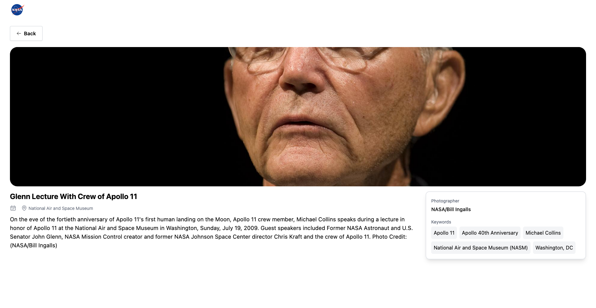

# NASA Image Library App

This app allows users to search for images from NASA's image library.

## Features

- Search for images by text query and/or date range
- Navigate through search results using infinite load
- View image details and metadata
- Responsive design

## Getting Started

### Prerequisites

- Node.js (version 14 or later)
- yarn (version 1 or later)

### Installation

- Clone the repository to your local machine: `git clone https://github.com/VihoSerge/nasa-media-library.git`
- Change into the project directory: `cd nasa-image-libraray`
- Install dependencies: `yarn install`

### Usage

- To start the app in development mode, run: `yarn start`
- Open http://localhost:5173 to view it in the browser.
- To build the app for production, run: `yarn build`
- The production build will be located in the dist directory.

### Tests

To run the tests, run: `yarn test`

## Technologies Used

- React
- React Router
- Axios
- React Query
- Tailwind CSS
- React Datepicker
- Vite

## Preview

Search page

Details page

